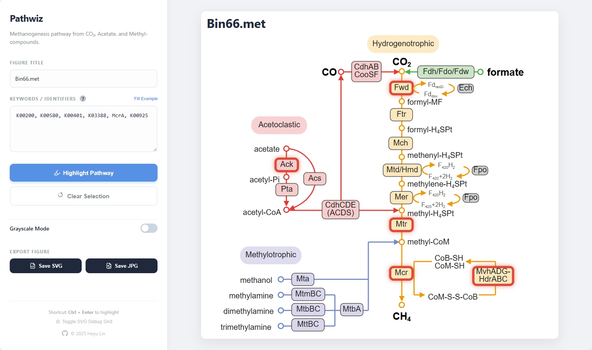

# Pathwiz

A web app to create simplified pathway visualizations for environmental microbiology.

UI preview:

## Usage
Download the html file in the repository and open it in your web browser (recommended: `Chrome` or `Edge`). You'll find out how to use it as it's simple enough.

This is also hosted GitHub at: [https://silentgene.github.io/pathwiz/methanogenesis_viz.html](https://silentgene.github.io/pathwiz/methanogenesis_viz.html)

## My Pain Point

Every time I get my hands on fresh gene annotations, I face the same existential crisis: mapping those genes onto massive pathway diagrams. It's like trying to find specific LEGO pieces in a giant bin... while blindfolded... in the dark.

Take methanogenesis, for example. Dozens of genes functioning in this pathway, giving me a headache everytime. 🌀

No doubt, [KEGG](https://www.genome.jp/kegg/) provides incredibly comprehensive pathway maps, and I'm genuinely grateful for their work. But let's be honest: their complexity level often lands somewhere between "mildly terrifying" and "please make it stop." 

During one of my presentations, I proudly showed my supervisor how I'd mapped our genes onto a KEGG pathway, like [this](https://www.kegg.jp/pathway/map00680+M00356). His response?

\- "This is... very confusing." 

\- *Ouch.* 💔

That's when I decided: enough is enough. Time to build something cleaner, simpler, and maybe even enjoyable to use.

## What Does Pathwiz Do?

This web app aims to provide **clean, simplified pathway visualizations** for commonly studied pathways in environmental microbiology. Users can:

- 🎯 Submit KEGG IDs or gene names
- ✨ Watch as nodes light up on the pathway map
- 🚀 Quickly identify what functions their genes can perform

## Current Status

**Version:** Early but functional! 🎉

I've built the first example using **methanogenesis** as a proof of concept. It works, it looks pretty decent (I think).

## Roadmap

- ✅ Methanogenesis pathway (done!)
- 🔜 Sulfur cycle
- 🔜 Nitrogen cycle
- 🔜 TCA cycle
- 🔜 Calvin cycle
- 🔜 Wood-Ljungdahl pathway
- 🔜 More pathways as time permits

## 🌕 Ambitious Goals (which might not happen)

1. **Visual Pathway Customization**: Allow users to customize pathway maps through a simple visual interface.
2. **Custom Enzyme IDs**: Allow users to map their own IDs to enzymes, moving beyond just KO IDs.
3. **Genome Database Integration**: Select a genome from a database to automatically highlight its annotated pathways.
4. **And more...**

## Want to Contribute or Request a Pathway?

Got ideas? Want to see a specific pathway implemented ASAP? Drop an issue and let me know! I'll do my best to make it happen. Hand-drawing SVG pathway maps is... not trivial. It turns out making aesthetically pleasing biochemical diagrams is harder than actual biochemistry. Who knew? 😅

## Technical Stack

- HTML, CSS, JavaScript
- D3.js for data-driven documents and SVG manipulation

> [!NOTE]
> Pathwiz is serverless. You can just open the HTML file and the web app will run in your browser.

...🧙‍♂️🧬
